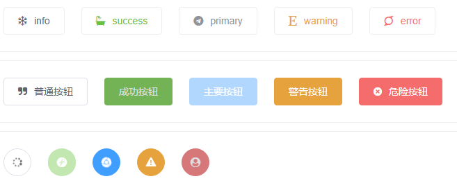

<h1 align="center">v-easy-message</h1>

<p align="center">
	<a href="https://github.com/Linkontoask/v-easy"></a>
	<a href="https://github.com/Linkontoask/v-easy"></a>
	<a href="https://github.com/Linkontoask/v-easy"></a>
	<a href="https://github.com/Linkontoask/v-easy"></a>
</p>

<p align="center">
	
	
	
	
	
</p>

### Demo
[OnlineDemo](https://linkontoask.github.io/demo/v-easy/index.html)

### Install
```
npm install v-easy-message -s
```

### Quick Start
``` javascript
import vEasy from 'v-easy-message'

Vue.use(vEasy);
```

### Code Start
``` javascript
<template>
    <VEButton @click="send('info')" class="center" type="primary" icon="chrome" :rotate="true" :circle="true"></VEButton>
</template>

<script>
export default {
    methods: {
        send(type) {
            this.$msg({
                type: type, //'success', 'error','info','warning'
                message: 'infomation',
                duration: 3000,
                onClose: () => {
                    console.log('callback');
                }
            });
        }
    }
}
</script>
```

### LICENSE
[MIT](https://github.com/Linkontoask/v-easy/blob/master/src/components/message/LICENSE)
